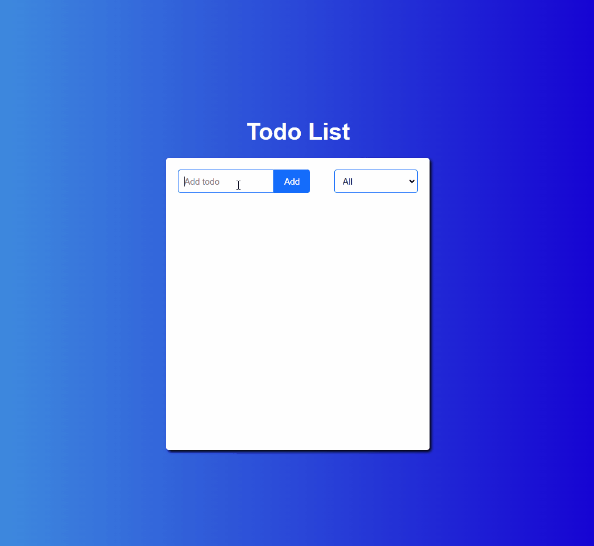

# todo-list

Todo list app created as a personal project.

# [🔗 View Deployed Application](https://hoang0211.github.io/to-do-list/)

## Table Of Contents

- [Application Features](#Application-Features)
- [Technologies Used](#Technologies-Used)
- [Future Additions](#Future-Additions)

---

## Application Features

A todo list web application that allow users to manage the status of their tasks.

### Requirements

- Simple to use interface.
- Tasks can be added, edited, deleted, or marked as complete.
- Tasks with different status can be filtered from the list.
- Created tasks need to be stored in local storage so reloading web page will not remove them.
- Application layout is responsive.

  

[Back To Top](#Table-Of-Contents)

---

## Technologies Used

- React.js (Hooks)
- Node SASS
- Local Storage
- GitHub Pages

[Back To Top](#Table-Of-Contents)

---

## Future Additions

[Back To Top](#Table-Of-Contents)
